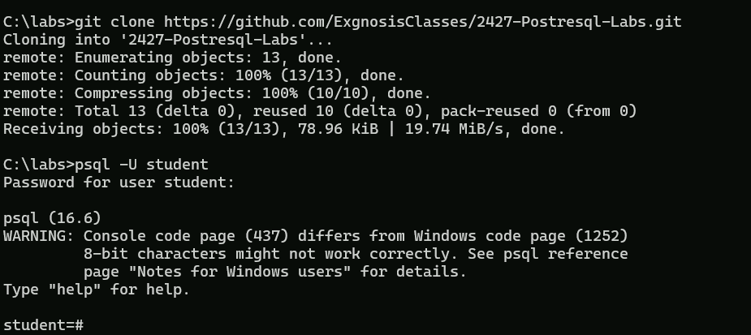
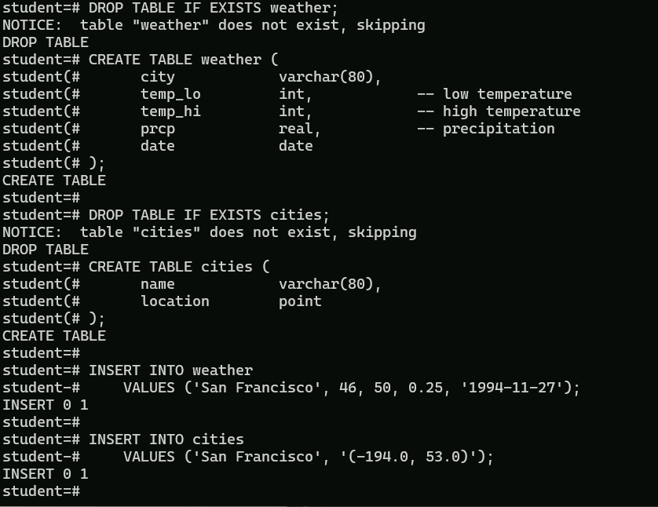
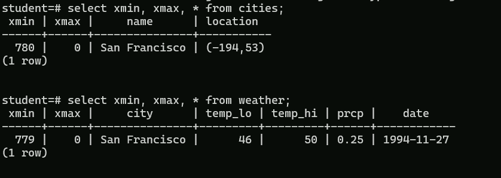
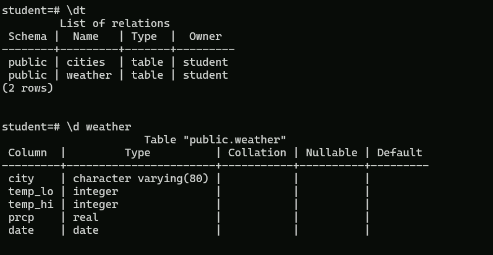

# Lab 2-1: Using psql 

### Objectives

1. Explore the command line options

For this lab, you might find it useful to clone the labs repository into the VM from here [Postgres Labs](https://github.com/ExgnosisClasses/2427-Postresql-Labs).

In the screenshots that follow, a directory called `C:\labs` has been created, and we are working in postgres as the user `student`.

This is what the CM looks like after cloning the labs and logging in. 




### Part 1: Create the data

Open the file `lab2-1.sql` from the repository in your VM using a text editor.

Copy and paste the contents into the `psql` shell.

You should see something like this:



And then you can query the table. However, when we created the table and then updated the rows, it was done in a transaction, which when commited, was written to the WAL logs on disk.

The rows also have lifetime snapshot with two value `xmin` and `xmax`. The first represents the transaction id that created the row. Any other transaction whose id is greater than `xmin` and less than `xmax` can read the row.

Transactions that have a lower ix or transaqction id were started before the update so they are not allowed to read this update otherwise we would get a dirty read.

The `xmax` represents the transaction that updated the previous data. So other transaction with an id greater than `imax` will be show update values. By convention, 0 is taken to mean infinity in `imax`,




To confirm that the table has been created properly and the data is in the table, execute the `\dt` command to display the tables in the database and use the `\d weather` command to see a description of the table schema. Also try `\d+ weather`



Once this is done, use the `\q` command to log out.


  
---

## Part 2: Command line options

Experiment with the command line options by running the following command. Note that the file `myfile.txt` is in the lab folder in the repository. Make sure the file is copied to the directory you are running `psql` from.

```shell
psql -U student -l

psql -U student -c "SELECT * FROM cities;"

psql -U student -t -c "SELECT * FROM cities;"

psql -U student -f myfile.txt

psql -U student -f myfile.txt --echo-queries

psql -U student -t -f myfile.txt --echo-queries

psql -U student -t -A -f myfile.txt --echo-queries
```

## Part 3: Logging

Login in as `student` using

```shell
psql -U student -q -L mylogfile.txt
```
Notice the suppression of the welcome message. Now execute a command, in this case

```shell
SELECT * FROM cities;
```
Then log out with `\q`


Now check the directory you started `psql` from and look for `mylogfile.txt`

It should contain something like this

```text
********* QUERY **********
SELECT * FROM cities;
**************************

     name      | location  
---------------+-----------
 San Francisco | (-194,53)
(1 row)

```
---

## End Lab
