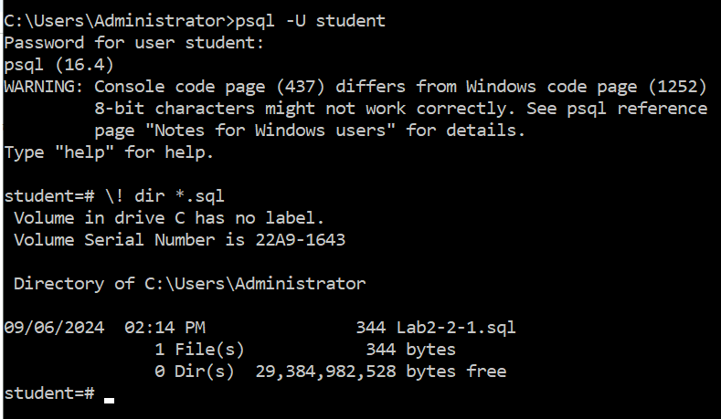
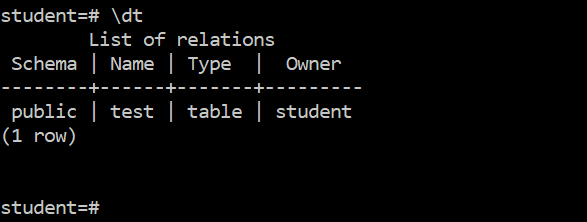
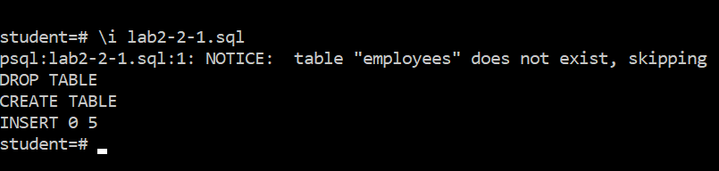
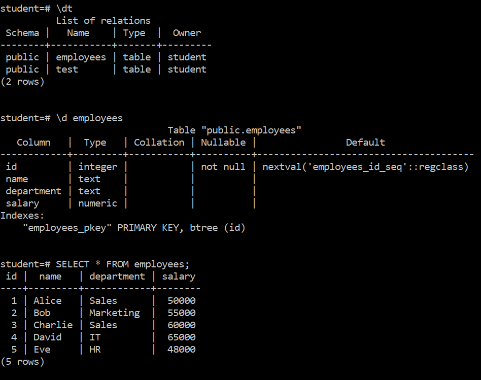
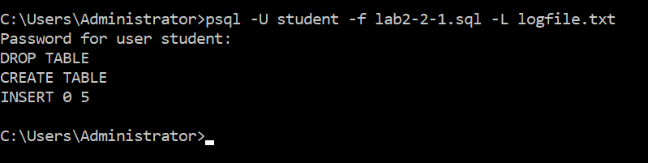
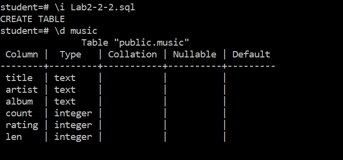
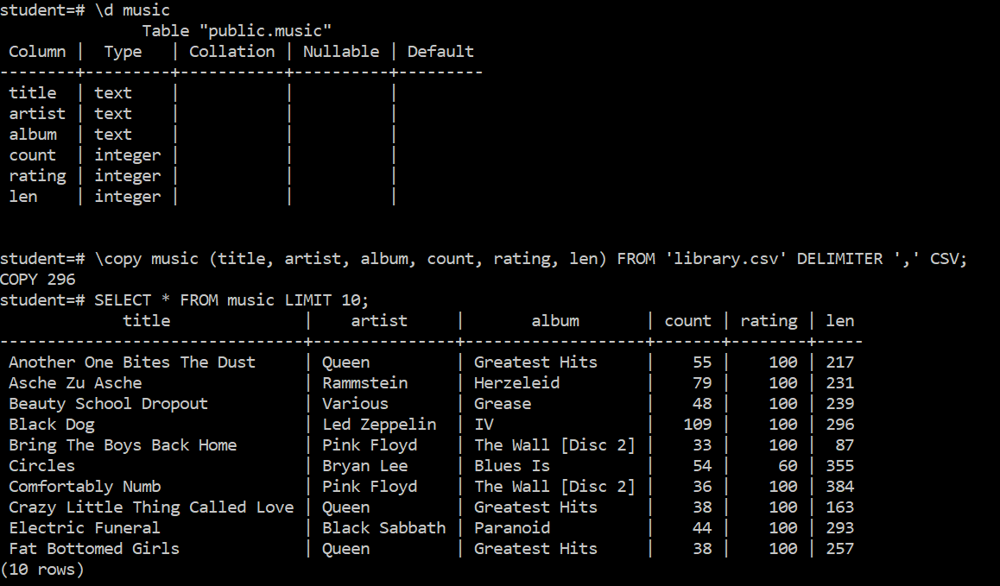

# Lab 2-2: Meta-commands

### Objectives

Work with psql meta-commands

### Part 1: I/O commands

#### 1.1 Setup

1. Login to your Windows VM.
2. Decide on a working directory, it doesn't matter where it is.
3. Copy the files ending in `*.sql` from the `Lab 2-2` directory in the repository to your working directory.
4. Open a command prompt and go the working directory you chose.
5. Log into your `student` postgres account on your Windows VM while in that directory

#### 1.2 Examine the first file.

1. Open the file `lab2-2-1.sql` in a test editor of VS Code. It should look like this.

```sql
DROP TABLE IF EXISTS employees;
CREATE TABLE employees (
    id SERIAL PRIMARY KEY,
    name TEXT,
    department TEXT,
    salary NUMERIC
);

INSERT INTO employees (name, department, salary) VALUES
('Alice', 'Sales', 50000),
('Bob', 'Marketing', 55000),
('Charlie', 'Sales', 60000),
('David', 'IT', 65000),
('Eve', 'HR', 48000);
```
Note the `DROP TABLE` command as the first line so you can re-run executing this file without manually having to delete the relation.


## Part 2: Interactive Input

Ensure that you are in the right directory by executing the `\! dir *sql` command. The result should look something like this.



Check to ensure that you don't have an `employees` table using `\dt`

In the screenshot below, there is only a test table in the database.



Interactively execute the `sql` file using the `\i lab2-2-1.sql` meta-command. The output should look like this:



Run the commands `\dt` and `\employees` to confirm the table is there and its schema is correct.

Then run the command `SELECT * FROM employees;` to confirm the data was loaded correctly.

You should see something like this:





---

## Part 3: Batch Input 

This is similar to what you did in the previous lab.

Drop the table you just created with the command `DROP TABLE employees;`

Then log out of your psql shell with `\q`

 At the command prompt, execute the following

`psql -U student -f lab2-2-1.sql -L logfile.txt`

You should see the following output:



Open `logfile.txt` in a text editor to see the result of running the fie

---

## Part 4: Import a CSV file


Copy the `library.csv` file from the repository to your working directory. This will be the file you will import.

Log into your psql student account and run the file `lab2-2-2.sql` as shown. You will have to copy it from the lab repository to your working directory first.

This will create a table called music that will be used to store a table of songs, albums and artists.

Confirm that the table is there using `\d music`



Now load the csv file into the table like this:

```shell
\copy music (title, artist, album, count, rating, len) FROM 'library.csv' DELIMITER ',' CSV;
```
Confirm the data was loaded by executing:

```shell
SELECT * FROM music LIMIT 10;
```
Your final result should look like this:



To clean up, drop the music table.

---

## End Lab


---

## End Lab
