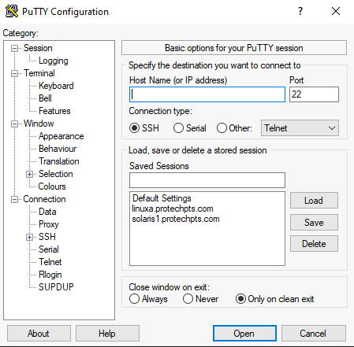
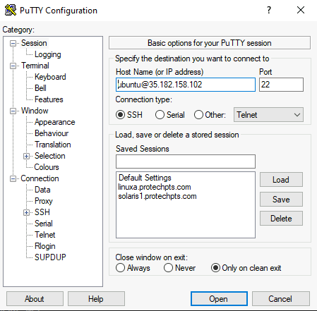
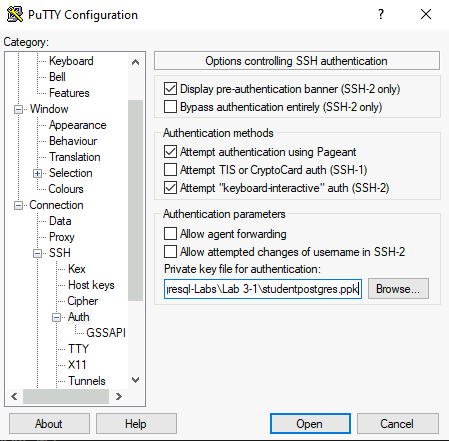
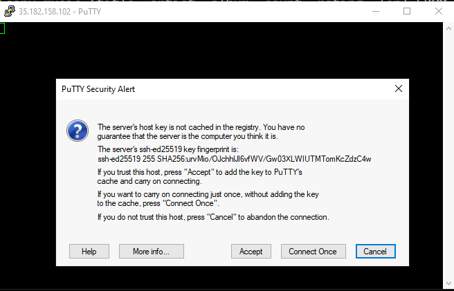
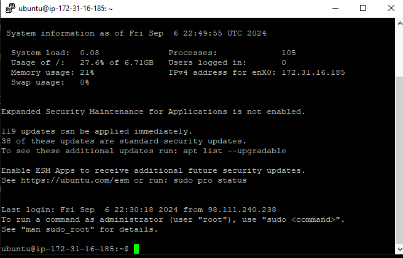
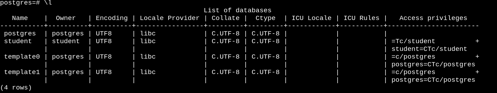
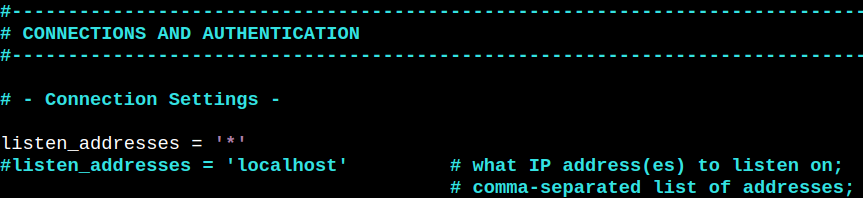
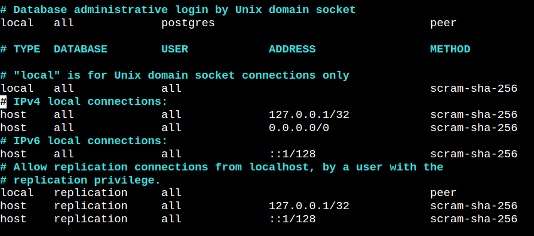
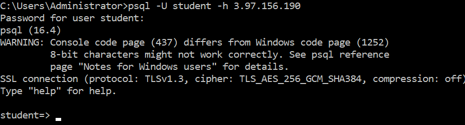

# Lab 3-1 : Installing PostgreSQL 

### Objectives

1. Login into your AWS machine
2. Install from binaries
3. Create a user and database
4. Configure remote access

## Update

The key required for logging in remotely cannot be stored in the GitHub repository since the security protocols will not allow it.

Instead, you will have to download it separately from a utility website.


### Part 1: Login to your AWS machine

**Note: The layout of putty changed but the instructor will go over the differences**

You will be provided with an IP address for an AWS EC2 instance running ubuntu. The instructor will walk you through the process of logging into your VMs. There is additional documentation on this process in the VMs directory in the repository.

You will be using Putty to connect.

Open the putty application from the taskbar


   
In the host name field, enter the connect string as shown below **but use the IP address you have been assigned, not the one shown**



Now you have to add the private ssh key. Open up the `SSH` option under `Connection` as shown and select `Auth` 

The key is not the same name as in the screenshot.

The key is `postgres.ppk` and is located on your desk top.




Select the browse button and then browse to the `studentpostgres.ppk` file and select it as shown

Select `Open` and you should see this screen



Select `Accept` and you should see:



You are now connected.


---

## Part 2: Install from binaries

For all of these commands, you may be prompted to proceed, answer yes or 'y' to any prompts.

#### Update the OS

This is optional but you can issue these commands once you login

```shell
sudo apt update
sudo apt upgrade
```
This may invalidate your connection so you may have to reconnect.


#### Install from the Ubuntu distribution

Now install from the ubuntu distribution binary with the commands

```shell
sudo apt install postgresql postgresql-contrib
```

--- 


## Part 3: Create a user and database

Once PostgreSQL has been installed, we need to create a user in addition to the default user `postgres`

By default, PostgreSQL is set up to use the “peer” authentication method, which allows you to log in to the database using the same username as your system user.

The default superuser for PQ is the user `postgres`. Normally, when a user connects to PQ, they connect to a specific database which defaults to the username. In the case of `postgres`, the default is the system database.

Note that we cannot log in directly as `postgres` at this point, nor generally should we want to, but we can execute the `psql` client locally by using the `su` command.

```shell
sudo -u postgres psql
```
Which should bring up the `postgres` shell. Note the `=#` in the prompt indicates that we are logged into `psql` as PQ superuser.

```shell
$ sudo -u postgres psql
psql (16.4 (Ubuntu 16.4-0ubuntu0.24.04.2))
Type "help" for help.

postgres=#
```


Create a new PostgreSQL user with a password. Note that the password string has to be in single quotes.

```shell
postgres=# CREATE ROLE student WITH SUPERUSER LOGIN PASSWORD 'Pa$$w0rd';
CREATE ROLE
postgres=#
```
Confirm the user is created using the `\du` meta-command. The screenshot is incorrect, the Superuser attribute should also be listed for student

```shell
postgres=# \du
                             List of roles
 Role name |                         Attributes                         
-----------+------------------------------------------------------------
 postgres  | Superuser, Create role, Create DB, Replication, Bypass RLS
 student   | 

postgres=# 
```

Create a default database for the `student` user and make `student` the owner. For convenience, we are naming it `student` to simplify the login process, but you can name it whatever you want.

```shell
postgres=# CREATE DATABASE student;
CREATE DATABASE
```

Give `student` all privileges to the database and make them the owner.

```shell
postgres=# GRANT ALL PRIVILEGES ON DATABASE student TO student;
GRANT
postgres=# ALTER DATABASE student OWNER TO  student;```
ALTER DATABASE
```

Confirm using the `\l` meta-command



---

## Part 4: Configure for remote access

By default, PostgreSQL uses the “peer” authentication method, which allows PQ roles you to log in to the database using the same username the corresponding system user.

This means that PQ allows only local connections. To enable access from remote machines, we need to modify the PQ configuration.

Note: Will be enabling connections from the entire Internet in this lab because we are relying on AWS firewalls to control which IPs can access your instance. However, this is **NOT** recommended for production use. Instead, a range of IP addresses should be specified to limit access.

### Modify the postgresql.conf file

In your instance, this file is located in the directory:

`/etc/postgresql/16/main`
     
Edit the file using `sudo vi` or `sudo nano`

```shell
ubuntu:/etc/postgresql/16/main$ sudo vim postgresql.conf
```
Add the line `listen_addresses = '*'` as shown.



Save the changed file.

### Modify the pg_hba.conf file

This file is in the same directory as in the previous step. Edit the file

```shell
ubuntu@ip-172-31-29-103:/etc/postgresql/16/main$ sudo vim pg_hba.conf
```

Add this line

`host    all             all             0.0.0.0/0               scram-sha-256`

and change the local-all-all line as shown here




Save the file

---

## Part 5: Restart and test

Restart the postgresql service so the changes can take effect

```shell
sudo service postgresql restart
```
Then login again over Putty.

#### Test a local connection

Try to login as `student`

```shell
$ psql -U student
Password for user student: 
psql (16.4 (Ubuntu 16.4-0ubuntu0.24.04.2))
```

Once you are logged in, confirm you are in the `student` database

```shell
student=> SELECT current_database()
current_database
-----------------
 student
(1 row)

student=> 
```

Log out of the shell using the meta-command `\q`

### Test a remote connection

Open a command console Window in your assigned VM. Log into the remote server you set up. Note that you will have to use the IP address of your AWS instead of the one shown here for the `-h` option.



---

## Clean up.

Shut down your connections. 

## End Lab
