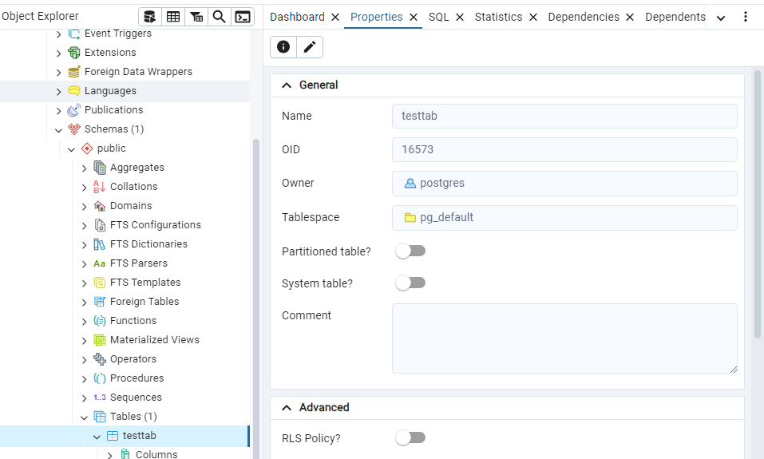

# Lab 3-2 : Working with OIDs

### Objectives

1. Explore the relationship between database objects and OIDs

## Part 1: Login in to your Windows VM

This lab can be done entirely in your Windows VM

- Open a command prompt and start `psql` as the `postgres` user. Recall that the password for `postgres` is `Pa$$w0rd`
- Also open the PdAdmin console and connect your local instance.
- Depending on whether the Unix server is reachable, you may or may not be able to connect to it, but you don't need to for this lab.

---

## Part 2: List the databases

In the command prompt use the `\l` meta-command. You should see something like this.


And using PgAdmin


   
---

### Part 3: Get the OID of the databases

Get the OID of the `test` database in PgAdmin by selecting it and the `properties` tab and can see it has OID `16564`


Looking into the file system, locate the corresponding directory as shown below


To confirm, query the system table `pg_database` using the command 

```shell
SELECT oid, datname FROM pg_database;
```
Which should produce the following output:


---

## Part 4: Get the OID of a Table

Change to the `test` database if you are not already there.
You can tell you are in the `test` database by the prompt or by using the command:

```shell
SELECT current_database();
````
As shown below


If you need to change to the test database, use the `\c test` meta-command.

Create a simple test table called 'testtab' using the command below. You should get the response `CREATE TABLE`

```shell
CREATE TABLE testtab (value Integer);
```
The pg_class system database contains metadata about all relations: tables, indexes, sequences, views, materialized views, composite types, and toast tables.

Get the oid of the table from the command line by using this command. 

```shell
SELECT oid from pg_class where relname = `testtab`;
```
You should see something like this, although the actual oid you see may be different.


Check this in PgAdmin by going to the database `test` and looking under `schemas/tables` and selecting the `properties` tab as shown.



Now check for the location of the file.

It is in the directory that corresponds to the oid of the database `test`.


Still working with the pg_class, we can see what sort of data is kept about each table by using the following command

```shell
\d pg_class
```

And you should see something like this


A description of these columns is in the notes section of the class.

You can experiment with a few of the following queries

List all indexes (use 'r' to see all tables)

```sql
SELECT relname, relkind
FROM pg_class
WHERE relkind = 'i'; 

```

Checking Table Size

```sql
SELECT relname, pg_size_pretty(pg_relation_size(oid)) AS size
FROM pg_class
WHERE relkind = 'r';


```
----

## Cleanup

If you want you can now drop the `testtab` table with the command 

```shell
DROP TABLE testtab;
```
---


## End Lab
