# Lab 3-3 : Working with User and Schemas

### Objectives

1. Create and modify users
2. Work with schema

## Part 1: Setup

This lab can be done entirely in your Windows VM

Ensure the file `lab3-3-1.sql` is in the directory you are working from

Open a command prompt and start `psql` as the `student` user. Recall that the password for `student` is `Pa$$w0rd`

Load the sql file into the database `student` and confirm it is there


And check that the data is there

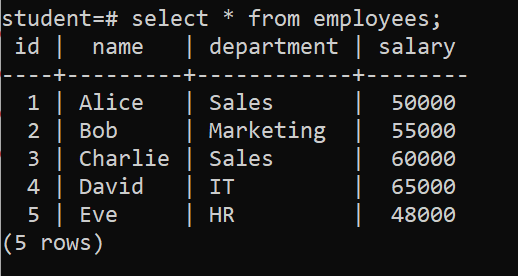

---

## Part 2: Create a Role

In the command prompt use the `\du` meta-command to the users.

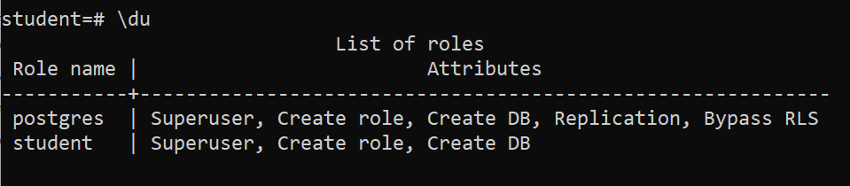

Create a new user 'bob'

```sql
CREATE ROLE bob;
``` 

Notice that 'bob' cannot log in

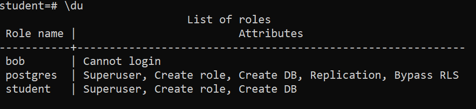

Historically, PostgreSQL made a distinction between roles and users similar to that between users and groups in Unix. That distinction has been blurred so now we generally speak only in terms of roles and tend to refer to roles that can login as users.

Now give bob the ability to login by using the ALTER command.

```sql
ALTER ROLE bob WITH LOGIN PASSWORD 'bob';
```

Check to see that the login restriction on bob has been removed.

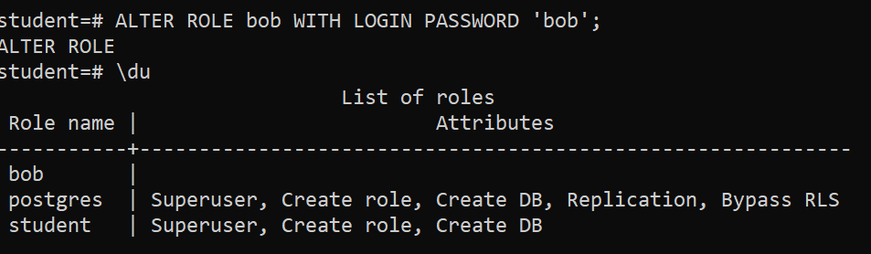

However, bob still cannot login because they have to access a database, and bob cannot access any database. There are several different things we can do.

#### Option 1: Give bob access to the student database and objects

As the owner of the student database, the user student can give bob a set of rights to access the database.

```sql
GRANT ALL PRIVILEGES ON DATABASE student TO bob;
```
If you check using `\l student` then there is an entry for bob in the right most colum that documents his rights for the student database

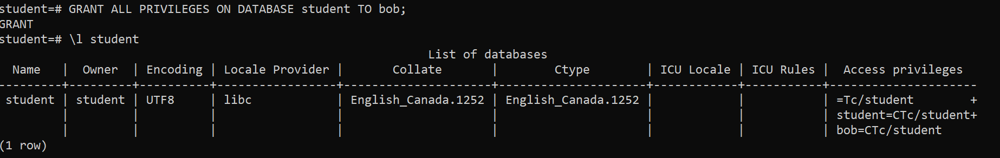

What we can do is create a database for bob and then make bob the owner. As owner, bob can locate to the database when he logs on.

Because you will be switching back and forth between users, you will find it helpful to open a new command prompt where you can log in as bob.

```shell
psql -U bob -d student
```

Bob can locate to the database but can't access the table `employees`. See this by trying to execute the following as `bob`

```sql
SELECt * FROM employees;
INSERT INTO employees (name, department, salary) VALUES ('Malini', 'IT', 50000);
```

Bob does not have permissions to do perform any actions on this table 

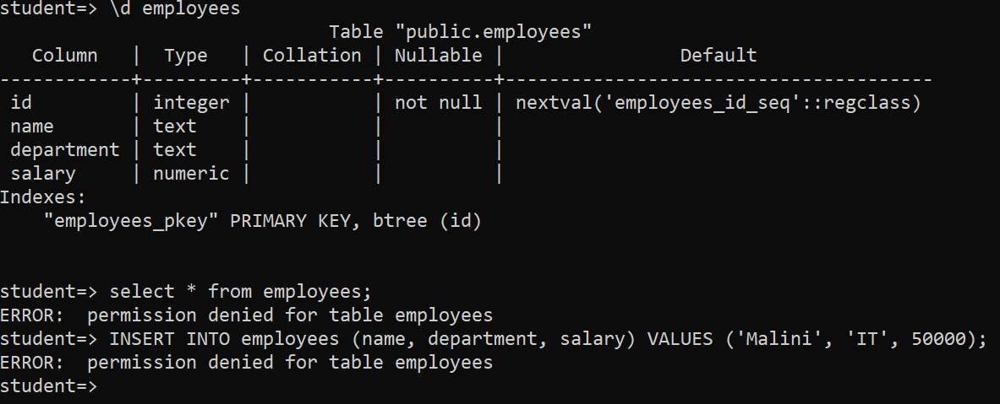

In order to access the table, bob has to be given permissions for the specific objects.

In the window you are logged in as `student` give bob permissions to use the table

```sql
GRANT ALL PRIVILEGES ON TABLE employees TO bob;
```
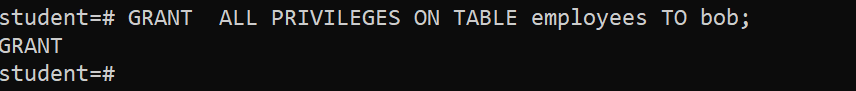

In the window where you are logged in as bob, notice that you can now execute the commands you just tried. Almost.


The problem is that the auto-generated index is also a database object that bob does not have permission to modify, which is what happens when bob tries to do an INSERT command.

What we can do is to use a schema to enclose create a subset of the database where bob has all permissions in that schema.

For example, if bob wants to create a table in `student` we can see that bob does not have permissions on the schema PUBLIC.

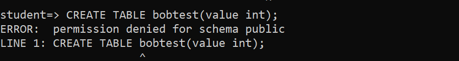

Just assume for now that we want to allow bob to work with the tables in the PUBLIC schema but not in any other schema, we can use the following permissions given by the `student` database owner

```sql
GRANT ALL PRIVILEGES ON ALL TABLES IN SCHEMA public TO bob;
GRANT ALL PRIVILEGES ON ALL SEQUENCES IN SCHEMA public TO bob;
GRANT ALL PRIVILEGES ON ALL FUNCTIONS IN SCHEMA public TO bob;
```

Now bob can do an insert into the table employees;

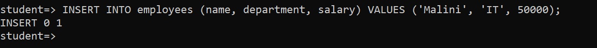

However, these permissions only apply to the existing object. Bob still can't create any new tables or objects. In order to do that, we need to give bob permissions to create new tables. Execute the following as student.

```sql
GRANT CREATE ON SCHEMA public TO bob;
```

Then try and create a table as bob.

```sql
CREATE TABLE bobtest(value int);
```

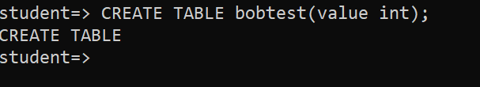

#### Option 2: Create a database for bob

As the student user, you can create a database and transfer ownership to bob.

```sql
CREATE DATABASE bob;
ALTER DATABASE bob OWNER to bob;
```

Then check to see that bob is the owner


Now log bob out and log bob back in without specifying a database and you should be located to the bob database

```sql
psql -U bob
```

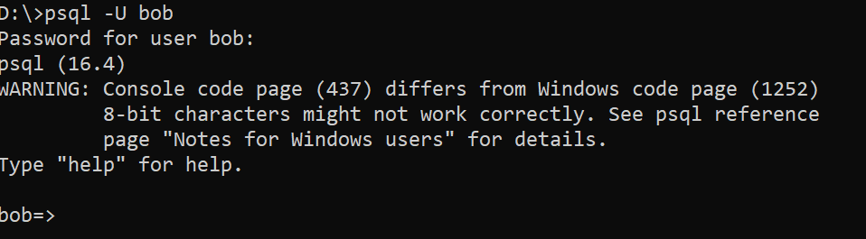

Now create the employees database using the sql file

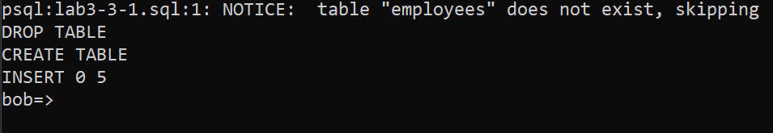

#### Option 3: Let bob create their own database

Since student is a superuser, that role can grant the CREATEDB capability to bob.

As student, execute the following command. 

```SQL
ALTER ROLE bob WITH CREATEDB;
```

Check to see that bob has now can create databases

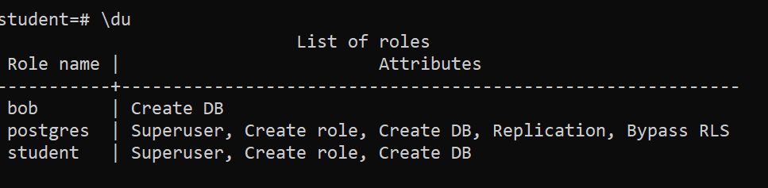

Now log in as bob or switch to the window where you are logged in as bob, create a database b2 and located to it

```sql
CREATE DATABASE b2;
\c b2
```

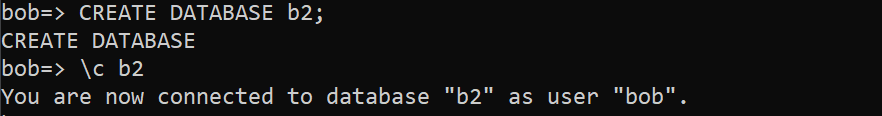

Since bob is the owner, bob has full permissions over the database.

---

## Part 3: Working with schema

For this part of the lab, you can log in as bob and use either of the databases that are owned by bob that you created in part 2 of this lab. The examples here will use the database b2.

```shell
psql -q -u bob -d b2
```

List the current schema using `ln`. Note that the default public one is owned by the database owner, in this case bob.

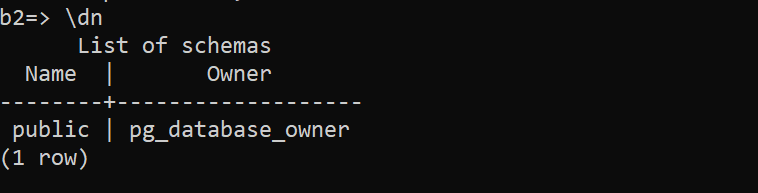

Create two new schemas `dev` and `ops`

```sql
CREATE SCHEMA dev;
CREATE SCHEMA ops;
```

And inspect with `\dn`

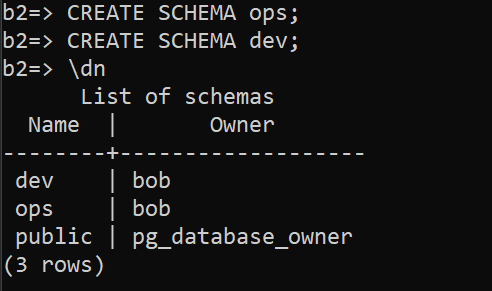

Now we will create the same table in each of the schema. Note that there is no prefix for the public schema. First the public schema. Create the table `t` with some identifying data

```sql
CREATE TABLE t(name VARCHAR(60));
INSERT INTO t VALUES('public');
SELECT * from t;
```

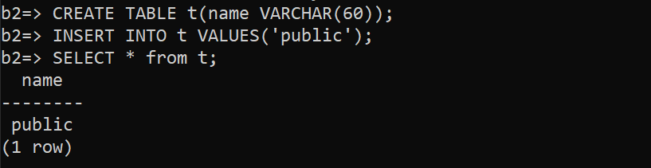

Now create the same table in the two other schema using their prefixes and load with identifying data. First the `dev` schema

```sql
CREATE TABLE dev.t(name VARCHAR(60));
INSERT INTO dev.t VALUES('development');
SELECT * from dev.t;
```

and for `ops`

```sql
CREATE TABLE ops.t(name VARCHAR(60));
INSERT INTO ops.t VALUES('operations');
SELECT * from ops.t;
```
 
Notice that the `\dt` command only lists the tables in the public schema by default. To see the tables in the schema ops, use `\dt ops.*` List the tables in the two schema you defined.


You can also see all the tables name `t` by querying the system catalogue.

```sql

SELECT * FROM pg_tables WHERE tablename='t';
```

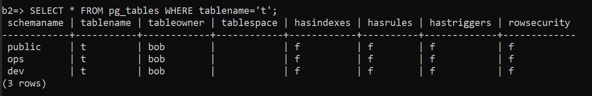`

Now drop the schemas. Normally you cannot drop a schema that contains database objects, but you can use the 
 CASCADE option to also drop the contents of the schema

```sql
DROP SCHEMA dev CASCADE;
DROP SCHEMA ops CASCADE;
```
## End Lab
