# Lab 4-1 : Tables

### Objectives

1. To explore table design in PostgreSQL 

## Part 1: Set Up

This lab can be done entirely in your Windows VM

- Open a command prompt and log in as the user `student` who is a superuser. Recall the password for student is `Pa$$w0rd`

Create a new database called lab using the command

```sql
CREATE DATABASE lab4;
```

Confirm the database exists using  `\l lab4` and switch to that database using `\c lab4`

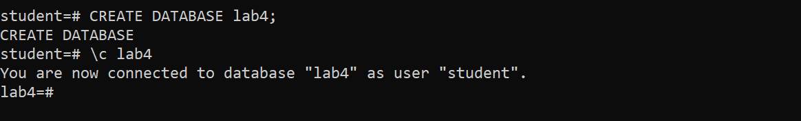

---

## Part 2: Create new table with AS

Create a new table called `employees` and populate it with data using these commands.

```sql
CREATE TABLE employees (
    id SERIAL PRIMARY KEY,
    name TEXT,
    department TEXT,
    salary NUMERIC
);

INSERT INTO employees (name, department, salary) VALUES
('Alice', 'Sales', 50000),
('Bob', 'Marketing', 55000),
('Charlie', 'Sales', 60000),
('David', 'IT', 65000),
('Eve', 'HR', 48000);
```

Or you can execute the file `emp.sql`

Check to see that the table is correctly constructed and populated.

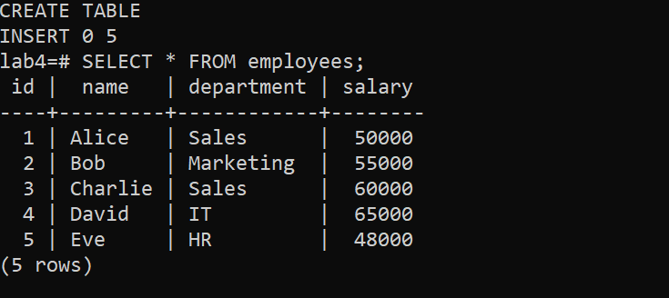


Create two new tables but copying the employees table. The first table, `e1` will include the data. Check to see the data is there.

```sql
CREATE TABLE e1 AS TABLE employees;
SELECT  * FROM e1;
```

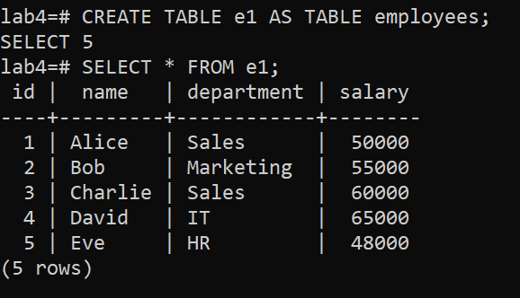

To see that the table is actually a copy, delete the entry for `Alice` in e1.

```sql
DELETE FROM e1 where name='Alice'
```

Then confirm Alice is deleted from e1 but not employees

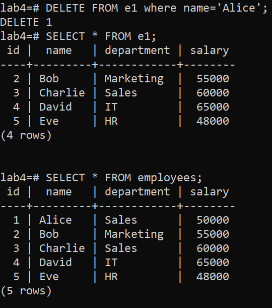

Now create a new copy the employees table but only the schema without any of the data. Confirm using select that there is no data.

```sql
CREATE TABLE e2 AS TABLE employees WITH NO DATA;
SELECT * FROM e2;
```
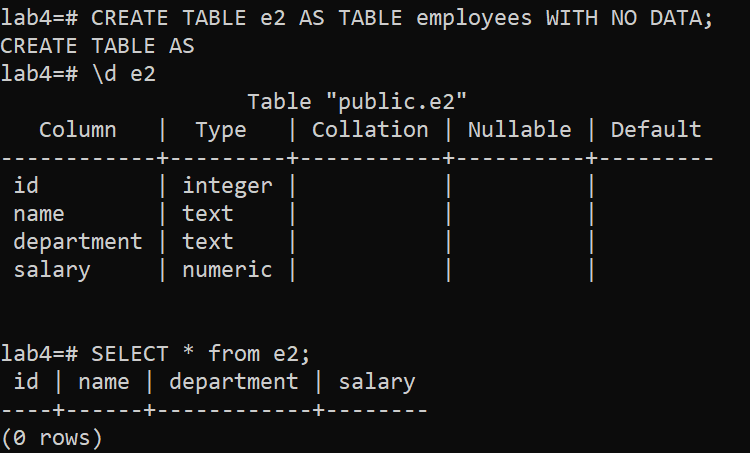

We can also use a SELECT command to copy specific rows and columns. In this part, you will create a new table called `sales` that will have only the name and department of the people in the employee table who are in the Sales department.

```sql
CREATE TABLE sales AS SELECT name,department FROM EMPLOYEES WHERE department='Sales';
SELECT * FROM sales;
```
The result should look like this.

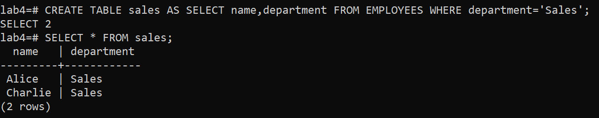

Drop the four tables

```sql
DROP TABLE e1, e2, employees, sales;
```
--- 

## Part 3: Inheritance

For this section start by defining a parent child relationship between the cities and capitals. (This example is based on the PostgreSQL tutorial).

Execute the file inherit.sql which executes the following SQL

```sql
CREATE TABLE cities (
        name		text,
        population	float8,
        elevation	int		-- (in ft)
);

CREATE TABLE capitals (
        state		char(2)
) INHERITS (cities);

INSERT INTO cities VALUES ('San Francisco', 7.24E+5, 63);
INSERT INTO cities VALUES ('Las Vegas', 2.583E+5, 2174);
INSERT INTO cities VALUES ('Mariposa', 1200, 1953);

INSERT INTO capitals VALUES ('Sacramento', 3.694E+5, 30, 'CA');
INSERT INTO capitals VALUES ('Madison', 1.913E+5, 845, 'WI');
```
then confirm the data:

```sql
SELECT * FROM cities;
SELECT * FROM capitals;

```

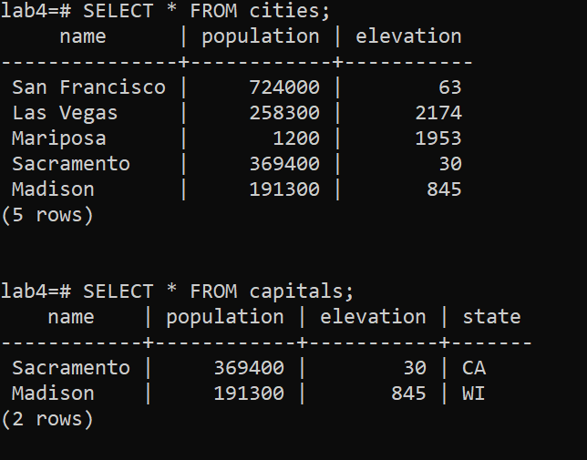

Using \d command shows that there is an inheritance relationship

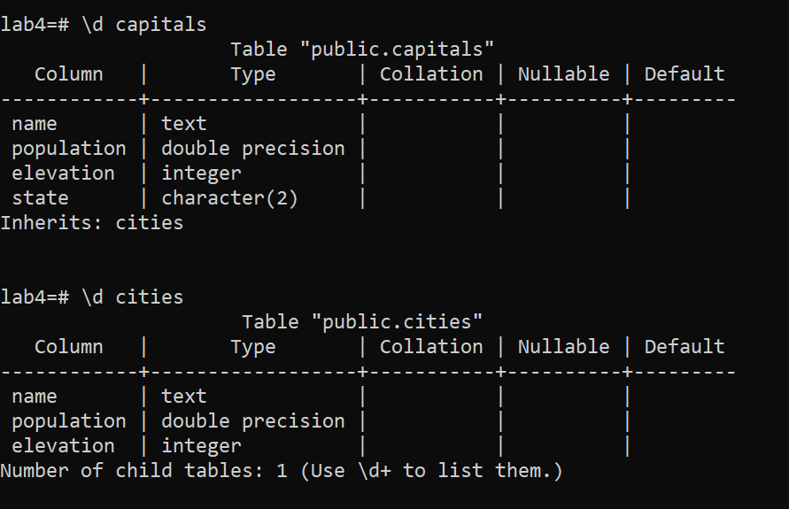

Now add a column to the parent table cities.

```sql
ALTER TABLE cities ADD COLUMN county VARCHAR(30) DEFAULT 'unknown' NOT NULL;
SELECT * FROM cities;
SELECT * FROM capitals;
```
Notice that new column appears in both the child and parent tables.

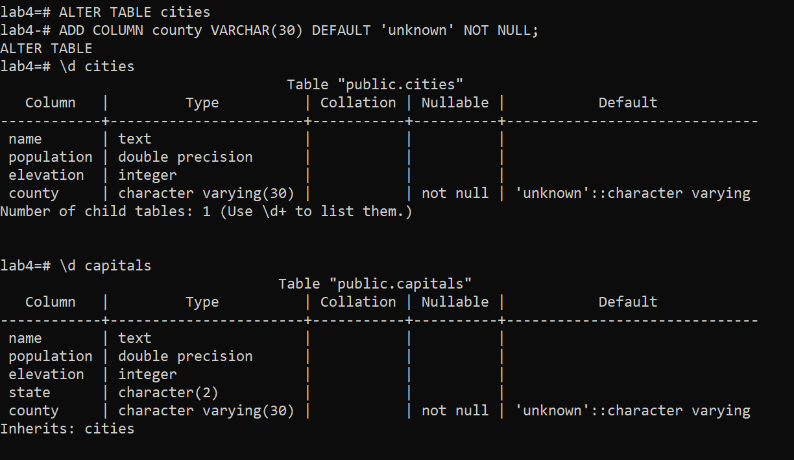

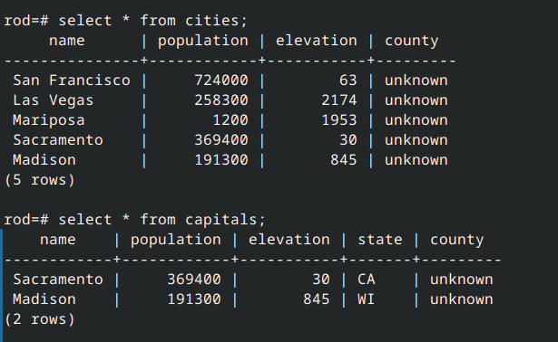


Now add a new column called motto to the capitals table

```sql
ALTER TABLE capitals ADD COLUMN motto VARCHAR(30) DEFAULT 'Huh?' NOT NULL;
```
As expected from how inheritance works, the column appears in the child table but not the parent table.

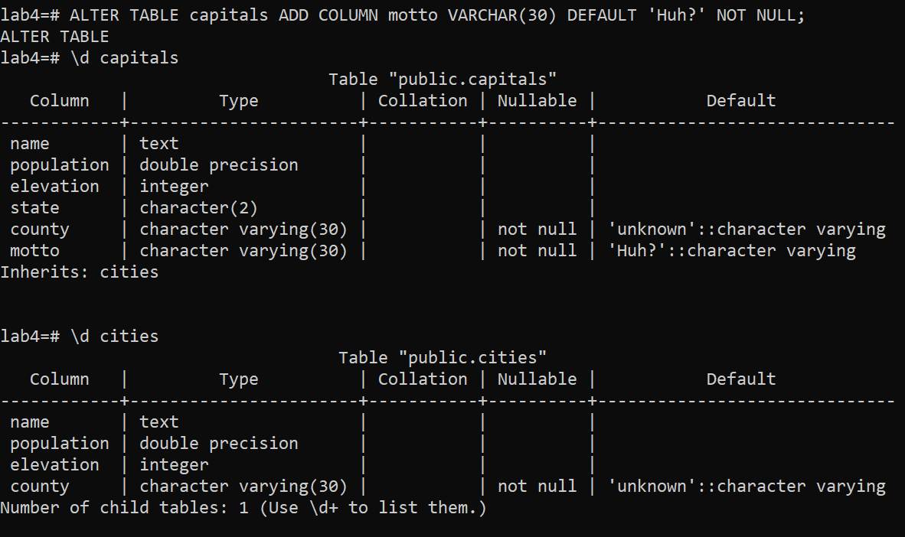

Now try and drop the population column from the child capitals table.

```sql
ALTER TABLE capitals DROP COLUMN population;
```
This produces an error since the population column definition is from the cities table.

However, we can do the opposite and drop the column in the cities table which means it is no longer inherited by the capitals table

```sql
ALTER TABLE cities DROP COLUMN population;
```
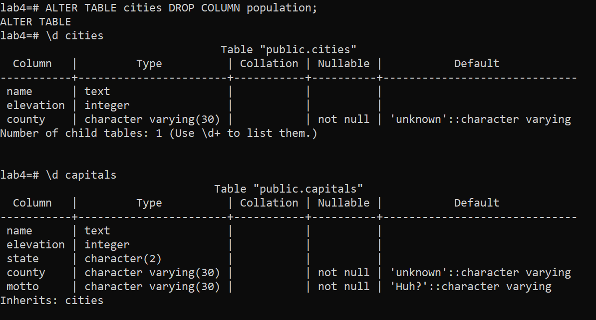

Why the restrictions? Because each table can be thought of as a overlay of columns on the same set of data, with the child tables adding extra columns.  To see this delete the entry from 'Madison' from the cities table.

```sql
DELETE FROM cities where name='Madison';
```
But now this data is gone from both tables

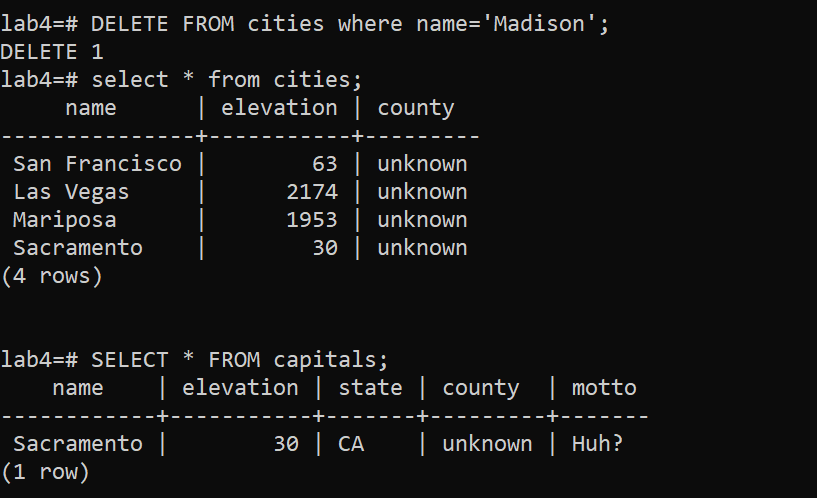

Likewise, when we delete 'Sacramento' from the capitals table, it no longer exists in the cities table.

```sql
DELETE FROM capitals WHERE name='Sacramento'
```

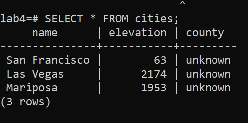

Clean up by dropping the tables, but note that you must drop the child table first.

---

## Part 4: Using a template.

First list the databases and locate `template0` and `template1`

Try to locate to template0 with `\c template0` which should be an error

The connection is refused because the template0 is isolated. But we can connect to template1 to make modifications to it.

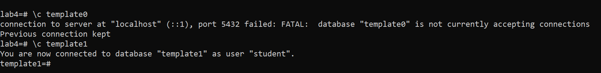

In this lab is you will create a new template, customize it and use that to create a new database.

First create the new template from template1. We also set the IS_TEMPLATE property to true to mark this as a template


```sql
CREATE DATABASE my_template TEMPLATE template1;
ALTER DATABASE my_template IS_TEMPLATE TRUE;
```

Then locate to it.

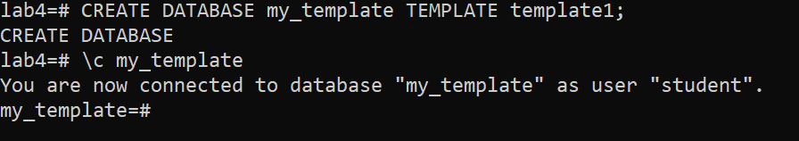

Create a table that will be a default table in all databases created with this template. And also mark the database as a template.

```sql
CREATE TABLE my_log (id SERIAL PRIMARY KEY, name TEXT);
CREATE DATABASE tbase TEMPLATE my_template;
```

Locate to this new database and check to see that the my_log table is there.

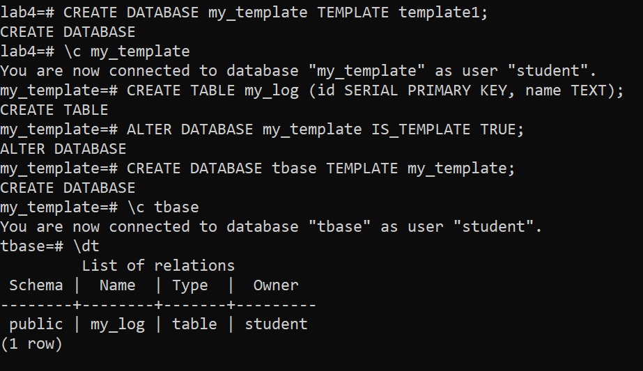

Go back to the database you were using before and delete the tbase database. Note that you cannot delete my_template because you marked it as a template.

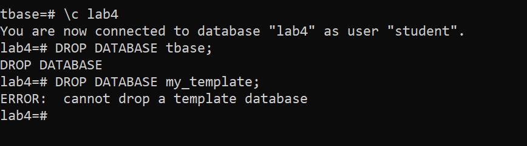

Unmark it as a template database, then you can drop it.

```sql
ALTER DATABASE my_template IS_TEMPLATE FALSE;
```

---

## End Lab