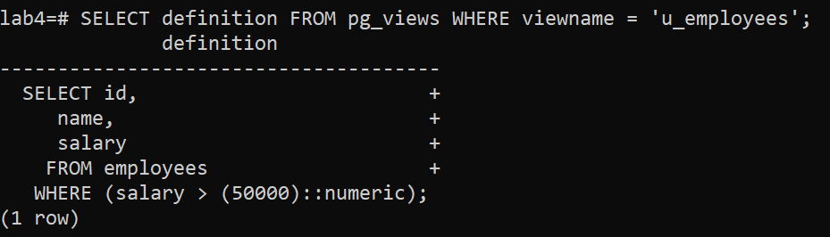
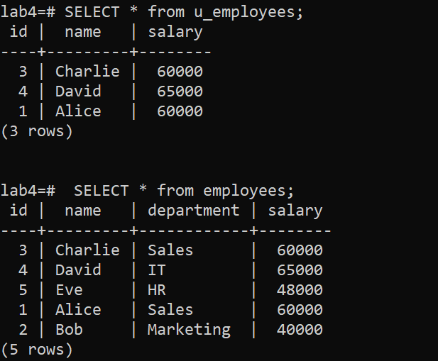
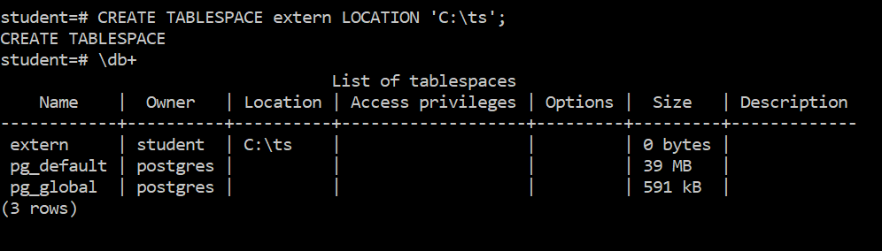

# Lab 4-2 : More Tables

### Objectives

1. To explore feature related to tables

## Part 1: Set Up

You can use the same database that you used in the last lab.

---

## Part 2: Working with views

Create a new table called `employees` and populate it with data using these commands. We did this before in a different lab. If you have that old data still around, delete the employees table first before doing this lab.

All the code for part 2 is in the file `views.sql`

```sql
CREATE TABLE employees (
    id SERIAL PRIMARY KEY,
    name TEXT,
    department TEXT,
    salary NUMERIC
);

INSERT INTO employees (name, department, salary) VALUES
('Alice', 'Sales', 50000),
('Bob', 'Marketing', 55000),
('Charlie', 'Sales', 60000),
('David', 'IT', 65000),
('Eve', 'HR', 48000);
```
### Updatable View

Create an updatable view like this

```sql
CREATE VIEW u_employees AS
SELECT id, name, salary
FROM employees
WHERE salary > 50000;
```

Confirm the view exists by using \dv

Show the data from the view


The raw sql can be seen using the following query

```sql
SELECT definition FROM pg_views WHERE viewname = 'u_employees'; 
```


Do an update on the original table.

```sql
UPDATE employees set salary=60000 where name='Alice';
```

Rerun the view and notice that Alice is now included in the view. This is expected behaviour of all non-materialized views.


What makes the view updatable is that changes to the view update the underlying table. The following command changes the data in the base table

```sql
UPDATE u_employees SET salary=40000 where name='Bob';
```

We can see this by running a couple of selects



### Non-updatable view

The view shown below includes an aggregation, which makes it non-updatable because the result set cannot be directly mapped to rows in the underlying table.

```sql
CREATE VIEW avg_salary AS
SELECT department, AVG(salary) AS avg_salary
FROM employees
GROUP BY department;
```

Running the query and listing its raw SQL is shown below;


### Materialized view

A materialized view stores the result set of a query physically and must be refreshed manually to reflect changes in the underlying tables.

Use the following command to create a materialized view.

```sql
CREATE MATERIALIZED VIEW m_employees AS
SELECT id, name, salary
FROM employees
WHERE salary > 40000;
```

Run the view and you should see the following;


Update the salary of Bob in the base table

```sql
UPDATE employees SET salary=99999 WHERE name='Bob';
```

Query the table and view and notice they are out of sync.


Because the view is not rerun automatically when it is used, we have to refresh it like this

```sql
REFRESH MATERIALIZED VIEW m_employees;
```

And now the data in the view is up to date.


Clean up your work by dropping the views and tables you have created in this section

Notice that if a view depends on a table, you have to drop the view first. When dropping a materialized view, you need to specify so that the associated disk files can be removed.


---

## Part 3: Partition a table

Create the same table and import the same csv file `library.csv` as we had before.

The code is in the file `part.sql`

We will use hash partitioning to create for roughly equal sized partitions. We could also partition based on artist, but we would need a partition for each artist, and that would take too long.

Create the partitioned table;

```sql
CREATE TABLE music (
    title TEXT,
    artist VARCHAR(255),  -- Use VARCHAR with an appropriate length
    album TEXT,
    count INT,
    rating NUMERIC,
    len INTERVAL
) PARTITION BY HASH (artist);
```
 We will use 4 partitions so create each partitions
 
```sql
CREATE TABLE music0 PARTITION OF music
    FOR VALUES WITH (MODULUS 4, REMAINDER 0);

-- Create the second hash partition (remainder 1 of modulus 4)
CREATE TABLE music1 PARTITION OF music
    FOR VALUES WITH (MODULUS 4, REMAINDER 1);

-- Create the third hash partition (remainder 2 of modulus 4)
CREATE TABLE music2 PARTITION OF music
    FOR VALUES WITH (MODULUS 4, REMAINDER 2);

-- Create the fourth hash partition (remainder 3 of modulus 4)
CREATE TABLE music3 PARTITION OF music
    FOR VALUES WITH (MODULUS 4, REMAINDER 3);

```

Use `\dt` to confirm


Now copy the data into the partitioned table

```sql
\copy music (title, artist, album, count, rating, len) FROM 'library.csv' DELIMITER ',' CSV;

```


There are 296 rows in the music table, which functions just as it would if it were not partitioned.

```sql
SELECT * FROM music WHERE artist='Queen';
```


Because of the hashing, we know that all of Queen's entries are in the same partition and not in any of the others.

```sql
SELECT * FROM music0 WHERE artist='Queen';
SELECT * FROM music1 WHERE artist='Queen';
```


Also, each of the partitions is roughly the same size. To see this, run the following command on each partition. Just music0 is shown here

```sql
SELECT count(*) FROM music0;
```

Also note that while all the entries for Queen are guaranteed to be in the same partition, it will not be the only set of entries in that partition.


Dropping the music table drops all the partitions.


---

## Part 4: Table spaces

In this section, you will create a tablespace called extern on your local file system.

First, create a directory on your local compute called `C:\ts` You don't need to set any permission in this case since you have a simple setup on the VM where everything is basically owned by 'Administrator' This will not be the case in production or other environments


The next part can be done either as postgres or student since both are superusers.  Login as student on your Windows VM and use the command `'\db+` to see the tablespaces.


The only two tablespaces are the two default ones created PostgreSQL.

Now create the new table space `extern` 

```sql
CREATE TABLESPACE extern LOCATION 'C:\ts'
```
Rerunning the `\db+` command shows the new tablespace



You can also query the system catalogue;

```sql
SELECT spcname, pg_tablespace_location(oid) AS location FROM pg_tablespace;
```


Create a table in the extern tablespace.

```sql
CREATE TABLE testtab(i int)  TABLESPACE extern;
```

Confirm that the table is in the table space. First by looking into the folder.


And by checking the system catalogue.

```sql 
SELECT tablename, tablespace FROM pg_tables WHERE tablename = 'testtab';
```


Now we drop the table and drop the tablespace.

```sql
DROP TABLE testab;
DROP TABLESPACE extern;
```

And confirm with `\db+`

---

## End Lab
