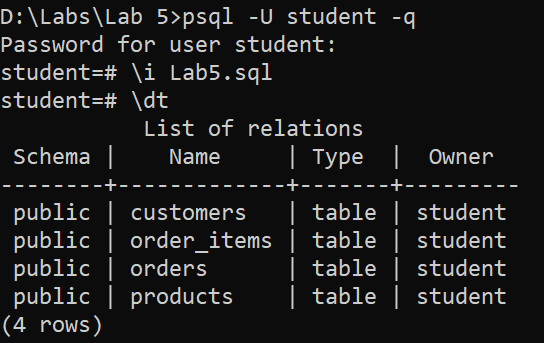
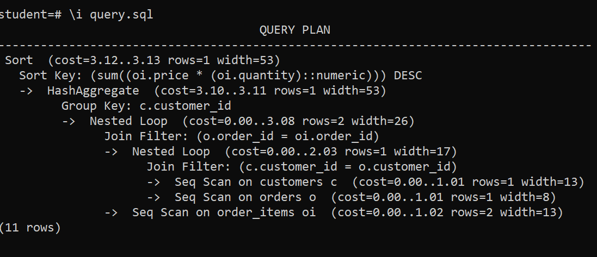
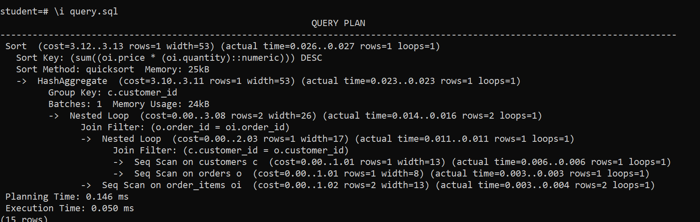
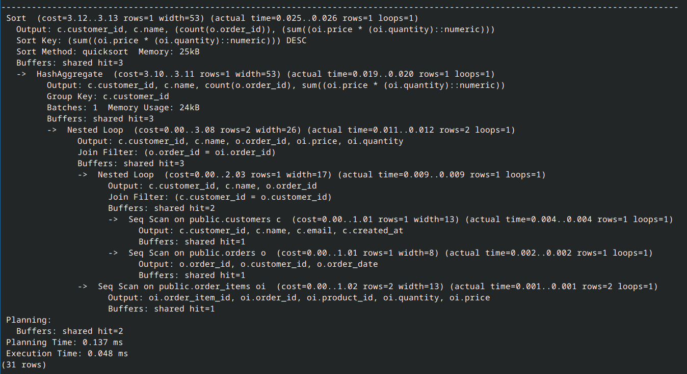

# Lab 5 : Query Optimization Using Explain

## Objectives
 
Use PostgreSQL EXPLAIN and ANALYZE to optimize a query

The code for this lab setup is in the file `lab5.sql`

## Part 1: Set up the tables and populate with data

You can run lab5.sql interactively or cut and past into your psql window.

Open up a command prompt in your Windows VM and start a psql sessions as `student` from the same directory that the lab sql files are in. The data schema is

```sql
CREATE TABLE customers (
    customer_id SERIAL PRIMARY KEY,
    name VARCHAR(100),
    email VARCHAR(100),
    created_at TIMESTAMP DEFAULT CURRENT_TIMESTAMP
);

CREATE TABLE products (
    product_id SERIAL PRIMARY KEY,
    name VARCHAR(100),
    price DECIMAL(10, 2)
);

CREATE TABLE orders (
    order_id SERIAL PRIMARY KEY,
    customer_id INT REFERENCES customers(customer_id),
    order_date TIMESTAMP DEFAULT CURRENT_TIMESTAMP
);

CREATE TABLE order_items (
    order_item_id SERIAL PRIMARY KEY,
    order_id INT REFERENCES orders(order_id),
    product_id INT REFERENCES products(product_id),
    quantity INT,
    price DECIMAL(10, 2)
);

-- Insert sample data
INSERT INTO customers (name, email) VALUES ('John Doe', 'john@example.com');
INSERT INTO products (name, price) VALUES ('Product A', 100.00), ('Product B', 200.00);

INSERT INTO orders (customer_id) VALUES (1);
INSERT INTO order_items (order_id, product_id, quantity, price) VALUES (1, 1, 2, 100.00), (1, 2, 1, 200.00);

```
You can load the data by using the meta-command `\i Lab5.sql`

It should look this




---

## Part 2: Analysis

Update the statistics to ensure that instance has the most recent data for its query planner. We are running tis command manually so that the instance will gather data about the tables we just created.

```sql
ANALYZE;
```

The query that we want to analyse is this one which is in the file `query.sql`.  But don't load this query into the psql environment because we don't want to execute it.

```sql
EXPLAIN
SELECT 
    c.customer_id, 
    c.name, 
    COUNT(o.order_id) AS total_orders, 
    SUM(oi.price * oi.quantity) AS total_spent
FROM 
    customers c
JOIN 
    orders o ON c.customer_id = o.customer_id
JOIN 
    order_items oi ON o.order_id = oi.order_id
GROUP BY 
    c.customer_id, c.name
ORDER BY 
    total_spent DESC;
```

What we want to do to is provide this query as input to EXPLAIN command

You can see this by running the file `\i query.sql` to see the output of the EXPLAIN command

This shows the query plan



If you edit the file and use EXPLAIN(ANALYZE), the play will produce computed run time statistics.



Running with EXPLAIN(ANALYZE, COSTS) shows the same output since ANALYZE also includes the costs. 

Other parameters are, that you can try running the analysis with are:

- ANALYZE: Executes the query and provides actual run time statistics.
- VERBOSE: Provides additional detail in the output.
- BUFFERS: Includes buffer usage statistics, which helps understand I/O impact.
- COSTS: Displays estimated start-up and total costs.
- FORMAT JSON: Outputs the plan in JSON format for easier parsing and automation.

Try running the same query but edit the EXPLAIN to use the commented out line at the bottom of the query.sql file.

The output should look more like this.



The output will include:

- Planning Time: Time spent planning the query.
- Execution Time: Time taken to execute the query.
- Actual vs. Estimated Rows: Comparison between estimated and actual rows returned by each operation, which helps identify if the planner's estimates were accurate.
- Buffers: Number of shared, local, and temp buffers hit, read, dirtied, or written.
- Join Types: Details of join strategies used, such as nested loops, hash joins, or merge joins.

What can be learned from the output

- Execution Time vs. Estimated Cost: Check if the execution time aligns with the estimated costs. Large discrepancies may indicate outdated statistics or missing indexes.
- Join Strategies: Analyze the types of joins used. If nested loops are used where hash joins would be more efficient, consider restructuring your query or adding appropriate indexes.
- Buffer Usage: High buffer reads might suggest missing indexes or inefficient data access patterns.
- Parallel Execution: Look for parallel execution plans if your query is complex and can benefit from parallelism. Adjust parallel settings if needed.

Ways to optimize

- Indexes: Ensure relevant indexes exist on join and filter columns.
- Vacuum and Reanalyze: Regularly run VACUUM and ANALYZE to keep statistics up-to-date.
- Query Hints: Use query hints (e.g., SET enable_seqscan = OFF;) to test alternative plans.
- Partitioning: Consider partitioning large tables if queries often filter by specific ranges or keys.


## End Lab
