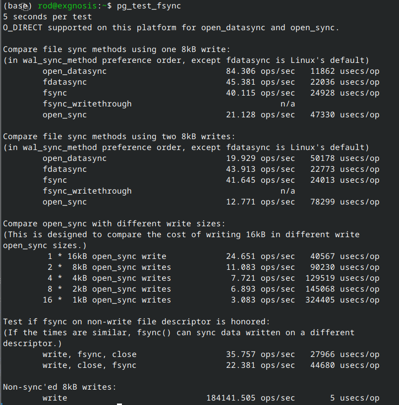

# Lab 6-1 : Configuration and monitoring

### Objectives


## Part 1: Configuration Files

Log into your Windows VM. You can do this lab with either the Windows or Unix instances

Log in as a superuser. Either postgres or student. In some of the screenshots below the user `rod` is a superuser.

The following sql queries are in the file `settings.sql` in the lab directory.

First, examine the schema of the pb_settings file using `\d pg_settings`. It should look something like this


Now run the following query to get a description of each parameter.

```sql
SELECT name, short_desc from pg_settings;
```

You should see a listing like this:


You can scroll through some of the listings

To see more data about the parameters, execute the following query.

```sql
SELECT name, setting || ' ' || unit as current_value, 
min_val, max_val, boot_val, reset_val 
from pg_settings;
```

You should see something like this.


To see where the parameters are set, run the following query

```sql
SELECT name, setting as current_value, 
sourcefile, sourceline, pending_restart
from pg_settings
where sourcefile is not null;
```

The output looks like this:


To see all the parameters that were set by default as well, run the above query without the WHERE clause. 

## Part 2: Dynamic Configuration

In this section, you will change the working memory parameter and monitor its value.

First show the current value using

```sql
SHOW work_mem;
```


Show where the parameter was set by running:

```sql
SELECT name, setting, sourcefile, sourceline,
applied, error 
from pg_file_settings
where name = 'work_mem';
```

The query returns no rows which means that this parameter was not set in any configuration file but is the default value.

Now set the value to '8MB'. 

```sql
SET work_mem = '8MB';
```


However, rerunning the query still gives no results because we have set the value dynamically.

Now use the ALTER SYSTEM command to write the new value to the postgresql.auto.conf file.

```sql
ALTER SYSTEM SET work_mem = '8MB';
```


However, running the query now shows that the value is set in postgresql.auto.conf


Change the value back 

```sql
ALTER SYSTEM SET work_mem = '4MB';
```
 Now run the query and you will see that the parameter has changed in the file.


**HOWEVER**

If we check the actual running value, notice that it did NOT change.


 
Why? Because the ALTER SYSTEM command changed the configuration file and did not change the current value. The changes to postgresql.auto.conf won't take place unless the configuration is reloaded.

However, since we used the SET command to set the memory for this session, this overrides any configuration file. 

To set the work_mem back to 4 for this session, use the command.

```sql
SET work_mem = '4MB';
```


Notice that if we do change the value for the session like this
```sql
ALTER SYSTEM SET work_mem = '8MB';
```

And confirm it is 8. Logging out of this session and then back in as student will use the original default value '4MB'

This is because of the context of the parameter in the file, it will be set to 8 when we restart the cluster.

---

## Part 3: fsync

One of the settings is which fsyc to use. There is a utility called pg_test_fsync that will provide a hint as to the best one to use.

On fedora 40 linux, the results are 



Try the same on Windows. Remember to run this as a command and not inside a postgresql session.

---

## Part 4: PGCONFIG

Go the  [pgconfig.org](https://www.pgconfig.org) site as shown in the demo.

1. Compare the different profiles.
2. Expand one of the parameters, say work_mem, and consult the explanation for what the parameter does.
3. Compare the amount of work_mem recommended for the different profiles.
4. Now go and alter the number of CPUs and other hardware values to see how the parameter values change.
5. Go to the `Export Config` section and compare the different options. Note specifically the ALTER SYSTEM option


``````
## End Lab
