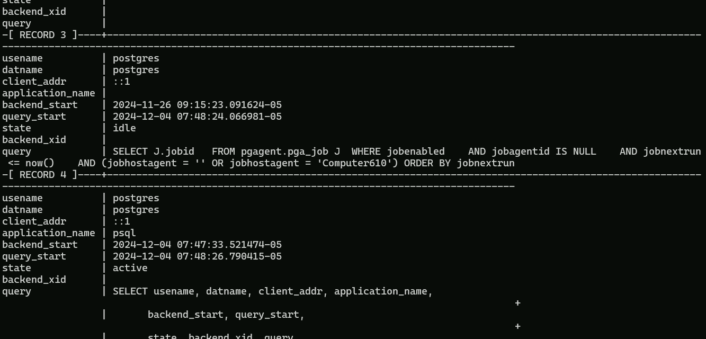
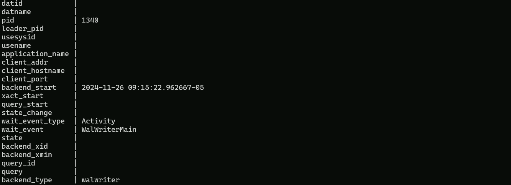
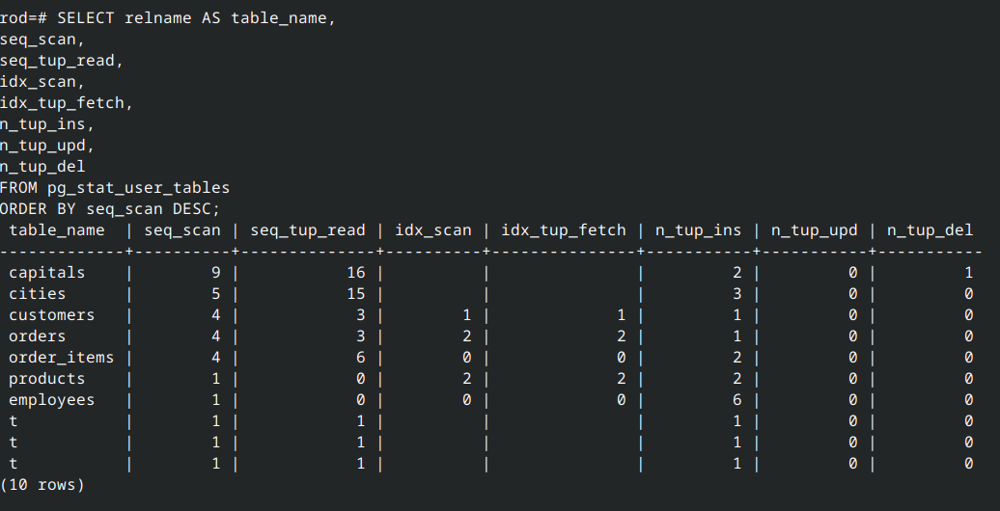
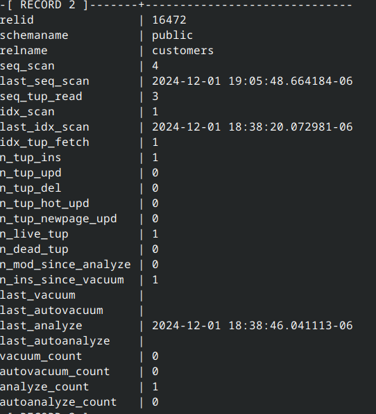
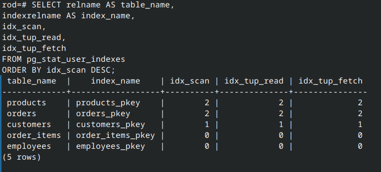
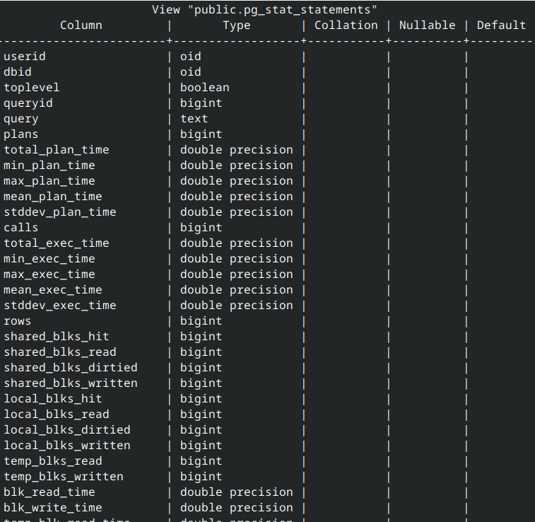
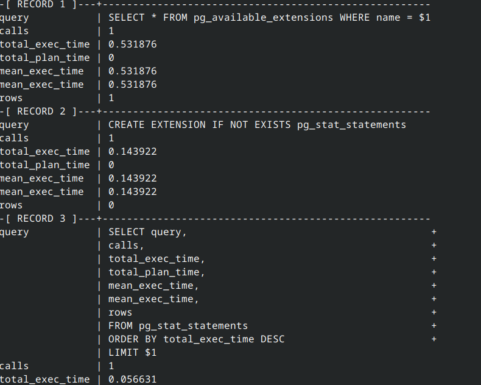

# Lab 6-2 : Performance Statistics


## Step 1: Connect to the PostgreSQL Database

You can use the Linux or Windows VM to do this. The extension is installed on your wWindows VM we will be using later. You may want to use the \x option to show some of the output

---

## Step 2: Check Active Sessions Using pg_stat_activity

Query the pg_stat_activity view to inspect current active sessions:

```sql
SELECT pid, usename, application_name, state, query, backend_start, state_change
FROM pg_stat_activity
WHERE state != 'idle';
```



1. pid: Process ID of the backend.
2. usename: Username of the connected session.
3. application_name: Application name using the session.
4. state: Current state (e.g., active, idle).
5. query: Current query being executed.

Compare this with a fill list of processes, you should be able to identify some of them. To this by re-running the previous query without the WHERE clause 


```sql
SELECT * from pg_stat_activity;
```



---

## Step 3: Monitor Table Usage with pg_stat_user_tables

Query pg_stat_user_tables to inspect table usage statistics. You may want to toggle back to the regular display using ]x

```sql 
SELECT relname AS table_name,
seq_scan,
seq_tup_read,
idx_scan,
idx_tup_fetch,
n_tup_ins,
n_tup_upd,
n_tup_del
FROM pg_stat_user_tables
ORDER BY seq_scan DESC;
```

Observe the following metrics:

seq_scan: Number of sequential scans.

idx_scan: Number of index scans.

n_tup_ins, n_tup_upd, n_tup_del: Number of rows inserted, updated, and deleted.



Check out the full table contents using \x

```sql 
SELECT * from pg_stat_user_tables;
```



---

## Step 4: Analyze Index Usage with pg_stat_user_indexes

Query pg_stat_user_indexes to check index usage statistics:

```sql
SELECT relname AS table_name,
indexrelname AS index_name,
idx_scan,
idx_tup_read,
idx_tup_fetch
FROM pg_stat_user_indexes
ORDER BY idx_scan DESC;`
```



Observe the following metrics:
- idx_scan: Number of index scans.
- idx_tup_read: Number of tuples read via the index.
- idx_tup_fetch: Number of tuples fetched by the index.

---

## Step 5: Examine Query Performance with pg_stat_statements

Ensure the pg_stat_statements extension is enabled:
```sql
CREATE EXTENSION IF NOT EXISTS pg_stat_statements;
```

Check out the data collected in the pg_stat_statements table 



Query the pg_stat_statements view to analyze query performance:

```sql
SELECT query,
calls,
total_exec_time,
total_plan_time,
mean_exec_time,
mean_exec_time,
rows
FROM pg_stat_statements
ORDER BY total_exec_time DESC
LIMIT 10;

```



Observe the following metrics:
- query: The query text.
- calls: Number of times the query was executed.
- total_*_time: Total time spent planning and executing the query
- mean_*_time: Average execution or planning timme per call.
- rows: Rows returned by the query.

---


``````
## End Lab
