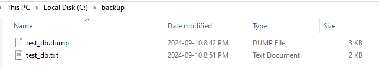

# Lab 7: Backup and Restore 

## Objectives

This lab will guide you through the process of performing a logical backup and restore of a PostgreSQL 16 database using pg_dump and psql commands.

## Part 1: Create the database and a sample table

Log in as student in you Windows VM

Create a database and locate to it using \c

In the database, create a table and insert some data

```sql
CREATE DATABASE test_db;
\c test_db

CREATE TABLE employees (
  id SERIAL PRIMARY KEY,
  name VARCHAR(100),
  position VARCHAR(50),
  salary NUMERIC(10, 2)
);
INSERT INTO employees (name, position, salary) VALUES
  ('Alice Smith', 'Manager', 75000),
  ('Bob Johnson', 'Developer', 65000),
  ('Carol White', 'Analyst', 55000);
```

## Part 2: Back up the database

Use pg_dump to backup the database to a location you choose. In the example, the location being used in `c:\backup` and the file is `testdb.dump`

Logout of the shell and run the backup utility. Notice this is being stored in the special backup format.

```shell

pg_dump -U student -d test_db -F c -f C:\backup\test_db.dump
```
To see the output in plain text execute the following command

```shell
pg_dump -U student -d test_db -F p -f C:\backup\test_db.txt
```

Check the directory and confirm that there are two backup files.



Open the text file and check the sql.

```text
--
-- PostgreSQL database dump
--

-- Dumped from database version 16.4
-- Dumped by pg_dump version 16.4

SET statement_timeout = 0;
SET lock_timeout = 0;
SET idle_in_transaction_session_timeout = 0;
SET client_encoding = 'UTF8';
SET standard_conforming_strings = on;
SELECT pg_catalog.set_config('search_path', '', false);
SET check_function_bodies = false;
SET xmloption = content;
SET client_min_messages = warning;
SET row_security = off;

SET default_tablespace = '';

SET default_table_access_method = heap;

--
-- Name: employees; Type: TABLE; Schema: public; Owner: student
--

CREATE TABLE public.employees (
    id integer NOT NULL,
    name character varying(100),
    "position" character varying(50),
    salary numeric(10,2)
);

... 
```

---

## Part 3: Delete the database and then recreate

Log into psql as student, and drop the test_db database. Then recreate it. The new version will not have the table we created

```sql
DROP DATABASE test_db;
CREATE DATABASE test_db;
```


---

## Part 4: Restore the database

Use the pg_restore command to restore the database

```shell
pg_restore -U student -d test_db -F c C:\backup\test_db.dump
```

Connect to the database and confirm the the table has been restored by using \dt

Clean up by dropping the database

## End Lab
