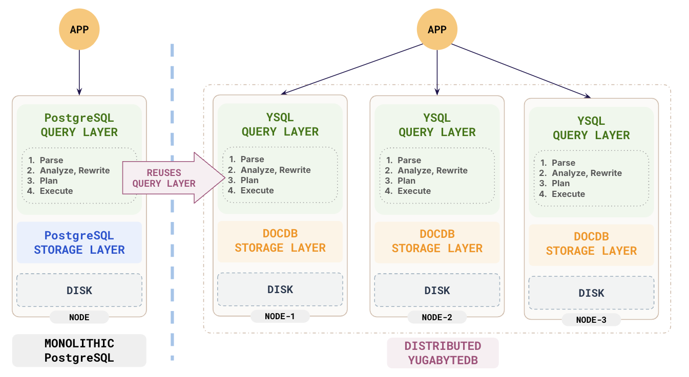

# Reading Notes

These are the reading notes to accompany the slides for the course. The notes consist of:

1. Links to reference material
2. Additional resources
3. Links to material added during class


The main PostgresQL documentation we will be referencing is here: [PostgreQL Official Documents]()

---

## Module 1 - Introduction

### Migration 

The primary reason for most migration to Postgres is the combination of cost and performance. Postgres provides performance equivalent to commercial products but without the licensing fees. The total cost of ownership is entirely based on the organization's internal spending.


Specific migrations will be discussed later. 


### YugabyteDB

Because Postgresql is open source, it is the perfect starting point for building other kinds of databases. For example, YugabyteDB replaces the underlying file system of a standard postgres database cluster with a distributed storage system. This sort of innovation is not possible with a proprietary database product like Oracle.



[YugabyteDB home page](https://www.yugabyte.com/)

---

## Module 3 - Installation and Config

#### Directories

Many of the directories contain working information used by PostgreSQL in executing tasks. Normally, these are managed internally by postgres. Some of these are:

1. pg_commit_ts: Stores the commit timestamps for transactions if the track_commit_timestamp feature is enabled.
2. pg_dynshmem: Holds files used for dynamic shared memory segments.
3. pg_logical: Contains files and subdirectories related to logical replication.
4. pg_multixact: Contains data related to multitransaction (multi-xact) structures.
5. pg_serial: Stores information about transactions that are part of the SERIALIZABLE isolation level.
6. pg_tblspc: Links to tablespaces created in the PostgreSQL instance.
7. pg_xact: Tracks the transaction commit status.

[System Catalogues](https://www.postgresql.org/docs/16/catalogs.html)

#### Key Columns in pg_class


**oid**	Object Identifier for the relation. Unique within the database.

**relname**	Name of the relation (e.g., table name, index name).

**relnamespace** OID of the schema (pg_namespace) containing the relation.

**reltype**	OID of the data type for the relation if it is a composite type; otherwise, 0.

**reloftype**	OID of the type if this relation is a typed table; otherwise, 0.

**relowner**	OID of the role that owns the relation.

**relam**	OID of the access method used (only for indexes).

**relfilenode**	Identifier for the physical storage of the relation on disk.

**reltablespace**	OID of the tablespace where the relation is stored (0 for default tablespace).

**relpages**	Approximate number of pages used by the relation on disk (deprecated in recent versions).

**reltuples**	Estimated number of rows in the relation.

**relallvisible**	Number of pages marked as "all visible" in the visibility map (used by VACUUM).

**reltoastrelid**	OID of the associated TOAST table, if the table uses TOAST for large objects.

**relhasindex**	Boolean indicating if the table has indexes.

**relisshared**	Boolean indicating if the relation is shared across all databases in the cluster (e.g., pg_database).

**relnatts**	Number of attributes (columns) in the table or composite type.

**relchecks**	Number of CHECK constraints on the table.

**relkind**	Type of relation:
- r: Ordinary table
- i: Index
- S: Sequence
- v: View
- m: Materialized view
- c: Composite type
- t: TOAST table
- f: Foreign table

**relpersistence**	Persistence type of the relation:
- p: Permanent
- u: Unlogged
- t: Temporary

**relispopulated**	Boolean indicating whether the relation is populated (used for unlogged and materialized views).

**relreplident**	Type of replica identity for replication:
- d: Default (ctid)
- n: None
- f: Full replica identity
- i: Index-based replica identity

**relispartition**	Boolean indicating if the table is a partition.

**relpartbound**	Partition boundary expression (if the table is a partition).

---
## Module 5: Optimization

[Rule System](https://www.postgresql.org/docs/16/rules.html)

[Indexes](https://www.postgresql.org/docs/16/indexes.html)

[Genetic Optimizer](https://www.postgresql.org/docs/16/geqo.html)

[Explain]()

## Module 6: Monitoring

[System Parameters](https://www.postgresql.org/docs/16/runtime-config.html)

[pgbadger](https://github.com/darold/)

### Monitoring tools

#### Links to Monitoring tools

[pgAdmin Official Website](https://www.pgadmin.org/)

[pgBadger GitHub Repository](https://github.com/darold/pgbadger)

[pg_top GitHub Repository](https://github.com/markwkm/pg_top)

[PostgreSQL Exporter GitHub Repository](https://github.com/prometheus-community/postgres_exporter)

[pgmetrics GitHub Repository](https://github.com/rapidloop/pgmetrics)

[Percona Monitoring and Management Website](https://www.percona.com/software/database-tools/percona-monitoring-and-management)

[pg_stat_kcache GitHub Repository](https://github.com/powa-team/pg_stat_kcache)

[TimescaleDB Official Website](https://www.timescale.com/)

[pgCluu GitHub Repository](https://github.com/darold/pgcluu)

---


## Using active directory

[Postgres and AD](https://www.strongdm.com/blog/connecting-postgres-to-active-directory-for-authentication)

[Integrating PostgreSQL with Active Directory for LDAP Authentication](https://medium.com/@kemalozz/integrating-postgresql-with-active-directory-for-ldap-authentication-360526dfdb25)

## Groups and Rolds

```sql
CREATE ROLE group_role;
CREATE ROLE user_role LOGIN PASSWORD 'xxx';
GRANT group_role TO user_role;

SELECT r.rolname AS member,
       m.rolname AS group
FROM pg_auth_members am
    JOIN pg_roles r ON am.member = r.oid
    JOIN pg_roles m ON am.roleid = m.oid
WHERE r.rolname = 'user_role';


```